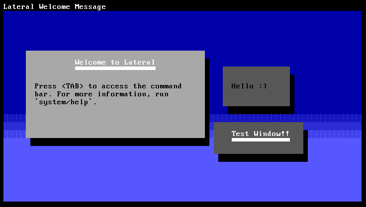

```
88        db    888888 888888 88""Yb    db    88
88       dPYb     88   88__   88__dP   dPYb   88
88  .o  dP__Yb -- 88 - 88"" - 88"Yb - dP__Yb  88  .o
88ood8 dP""""Yb   88   888888 88  Yb dP""""Yb 88ood8
```

---

### Lateral is a work-in-progress multitasking monolithic kernel + OS meant as a fun summer project.

It has recently expanded into more than I could imagine, and I'm looking to implement a fully usable operating system in the future.

## The Window Manager

Lateral's window manager contains a floating, widget-based desktop with custom syntax for defining window attributes and widgets via. Rust's macro system. Titles and (in the future) menu actions are displayed at the top blackout bar.

> 
> Screenshot of the Lateral window manager (taken in v0.2.1)

### Core Design

Windows can be controlled without a mouse in `Normal Mode` using the WASD keys, and the command-bar can be activated using `TAB`. Press `SPACE` to focus a window, which will capture all input. `ESC` will exit `Focus Mode`.

The command-bar is an essential design component inspired by apps like [Krunner](https://userbase.kde.org/Plasma/Krunner). While typing, the command-bar expands to show command parameters and a preview of the output (configured using the Lateral API). Commands return results via. a new window instead of plain text. This serves as a hybrid of the terminal and modern window managers, allowing all apps to provide output through the same paradigm.

Every app will execute through the command-bar. There is no included start-menu or terminal. When using Lateral, it's clear that nothing about it is POSIX-compliant. Each component is built on top of the window manager instead of the terminal, like most operating systems do.

### Running Applications

It's important to note that executable files are not located in the same place as non-executable files. Different filetypes are separated into different "partitions" in the filesystem itself.

| Section | Members |
| ------- | ------- |
| apps    | Any executable binary/script |
| configuration | Configuration files or serializable files |
| logs | Application log files |
| misc | Any other files |

The command-bar will match any executables in the user's directory. This is where compiled or installed applications are stored, ex: `apps: carter/hello-world`. You can also explicitly run executables from other users' directories if you have permission, ex: `system/help` runs `help` in the `system` folder (owned by `system`) inside of the `apps` section.

## Building and running

If you have GNU Make and QEMU installed, you can run `make run-release ARCH=x86_64` to build for x86_64 and run in the QEMU emulator.
